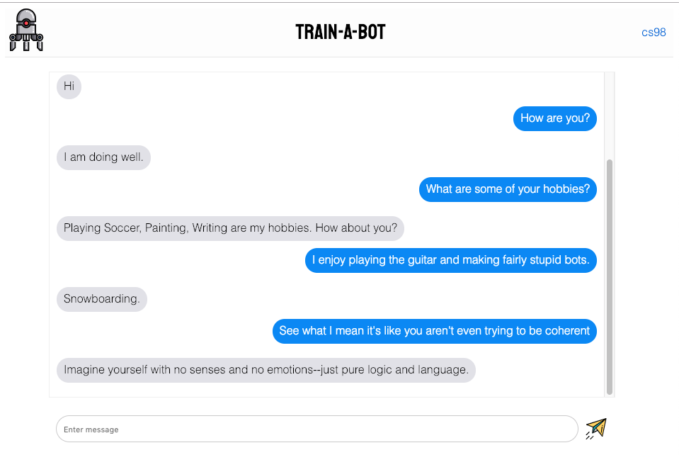

# TRAIN A BOT



To run:
```bash
    ./run
```

For this hackathon I decided to tackle functional programming using Elixir. I set out thinking of ideas of what I could build in Elixir. Having some experience in web design, I thought it would be interesting to build a web app in Elixir. I've always wanted to write a chatbot, so I decided to write a realtime chat with a chatbot app. 

Train-A-Bot is a webapp that allows you to chat with a chatbot. Chats with the bot are saved and used to train it. If I had more time, I'd like to create two modes: asking questions and answering questions. And perhaps add a small button next to the bot's responses so users can flag non-sensical answers. Using all this data, the chatbot could improve drastically. However, I stored the data and chose a ML framework that can easily extend to inlcude these features.

I followed the following tutorial to build the web app using Elixir and Phoenix: https://github.com/dwyl/phoenix-chat-example

This provided a detailed roadmap to using Phoenix as a web framework and using Elixir to power it. In addition, this tutorial uses PostgreSQL which I have not used before, though I prefer SQL query structures. I found it to be very intuitive and I'm a big fan of the pgAdmin dashboard.

I modified the program in several ways after the tutorial. I completely redesigned the front-end to have an iOS feel and to be generally good looking. I used https://codepen.io/samuelkraft/pen/Farhl as a base for the message bubbles, but modified them slightly to fit better with my design. I removed the "name" feature from the chat and instead made it a 1-1 chat with a bot vs. a live chat between many individuals. I also added code here to query the Python microservice that was running my chatbot. After receiving input from the front-end, the Elixir controller would insert the record into the DB (for training at a later time), echo the message to the chat, and then passes the input to the microservice to generate a chatbot response. Once the chatbot response is received by the client, it is echoed to the chat.


I used ChatterBot (https://chatterbot.readthedocs.io/en/stable/), a Python library that makes training a chatbot quite accessible. It includes an english corpus which I used for the hackathon. However, the package includes the capability of training the chatbot on your own data. The idea is that the chatbot uses the responses from users to further train itself.

Overall this was a very interesting project. I enjoyed using Elixir, and I can see its value for high reliability applications.
